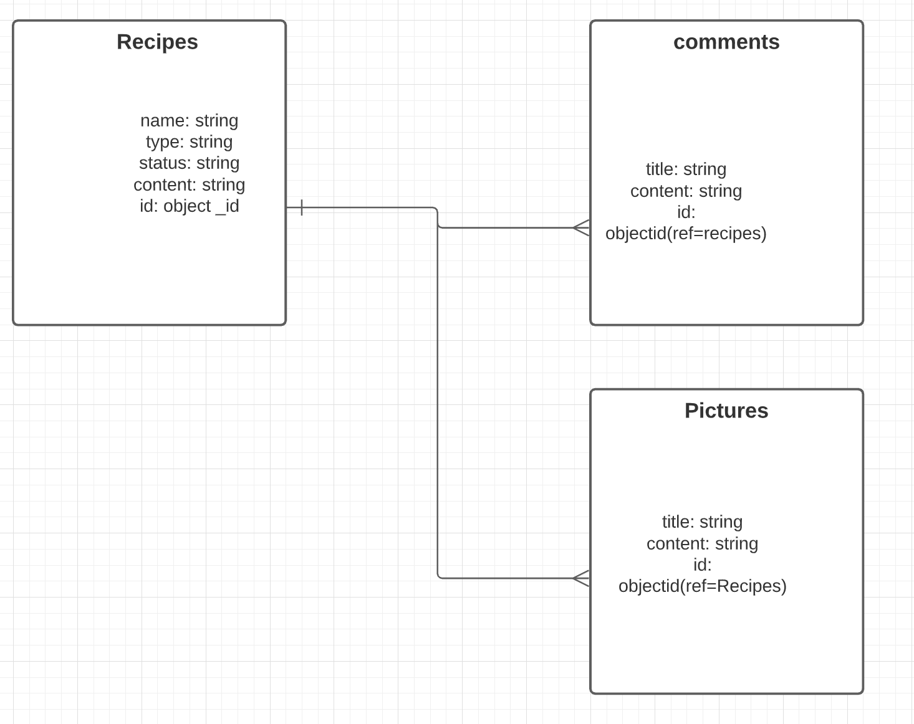

# Brew-Recipe-Tracker

Brew Tracker

### Date: 8/30/2021

#### By: Derek Valenciano

[Github](https://github.com/dvalenciano) | [Linkedin](https://www.linkedin.com/in/derekvalenciano/)

---

**_Description_**

This project is to show the understanding of fullstack web development from start to finish.

The idea behind this project is to create a full stack application that will store recipes that brewers create for later use or expansion and tracking. As a brewer there is a good amount of time from the actual brew date to when a beer has finished fermenting and is ready for consumption and that time many details can be forgtten. This application is aimed at tracking those details and recipes for brewers to access with ease and confidence of the data.

You can access the App by following this [link!]()

**_Technologies Used_**

- MongoDB
- Express
- React
- Node

**_Screenshots_**

Below are snippets of the early workings that indicate the beginning level of building a can online application using a fullstack method

Entity Relationship Diagram

Component Hiearchy Diagram

Mock Up Main

Mock Up Post

**_Future Updates_**

- [ ] API to import recipes from other brewing sources
- [ ] Update to include user profiles

**_Credits_**
